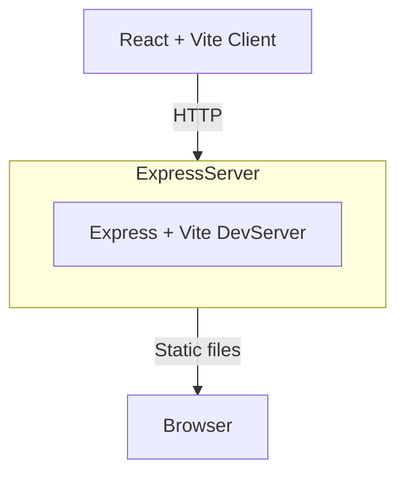

# Architecture Overview

This project ships a small Express server that serves the compiled React app. All
file conversions run in the browser using FFmpeg.wasm so the server only delivers
static assets.
